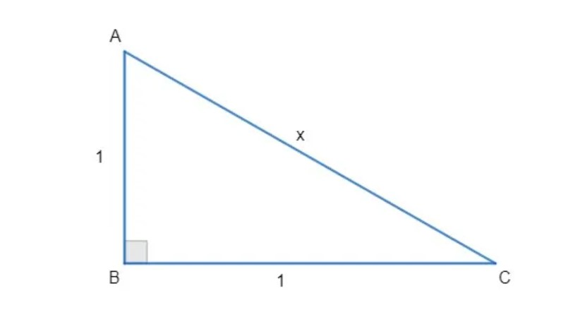

{width="90%"}

| **COMPONENTE CURRICULAR:** Física &nbsp; &nbsp; &nbsp; **DATA**: \_\_\_\_\_\/\_\_\_\_/\_\_\_\_\_\_                                                              
| **TURMA:** CICLO VI &nbsp; &nbsp; &nbsp; &nbsp; &nbsp; &nbsp; &nbsp; &nbsp; &nbsp; &nbsp; &nbsp; &nbsp;  **PROFESSOR:** Jailson Duarte                                                                                                        
| **ALUNO(A):** \_\_\_\_\_\_\_\_\_\_\_\_\_\_\_\_\_\_\_\_\_\_\_\_\_\_\_\__\_\_\_\_\_\_\_\_\_\_\_\_\_\_\_\_\_\_\_ 

# \centering Teorema de Pitágoras

O Teorema de Pitágoras relaciona o comprimento dos lados do triângulo retângulo. Essa figura geométrica é formada por um ângulo interno de 90°, chamado de ângulo reto.

O enunciado desse teorema é: A soma dos quadrados de seus catetos corresponde ao quadrado de sua hipotenusa." $a^2=b^2+c^2$.

\vspace{1cm}

**01.** Se um triângulo retângulo apresenta 3 cm e 4 cm como medidas dos catetos, qual a hipotenusa desse triângulo?

\vspace{0.8cm}

**02.** Determine a medida de um cateto que faz parte de um triângulo retângulo, cuja hipotenusa é 20 cm e o outro cateto mede 16 cm.

\vspace{0.8cm}

**03.** Um triângulo apresenta os lados com medidas 5 cm, 12 cm e 13 cm. Como saber se é um triângulo retângulo?

\vspace{1cm}

**04.** Determinar o valor de X no triângulo a seguir

{width="40%"}

\vspace{0.8cm}

**05.** Um terreno retangular será dividido ao meio, pela sua diagonal, formando dois triângulos retângulos. A metade desse terreno será cercada com 4 fios de arame farpado. Sabendo que as dimensões desse terreno são de 20 metros de largura e 21 metros de comprimento, qual será a metragem mínima gasta de arame?