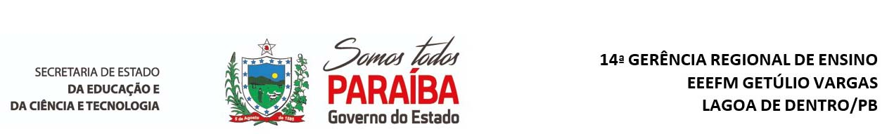

{width="100%"}

| **COMPONENTE CURRICULAR:** Química &nbsp; &nbsp; &nbsp; **DATA**: \_\_\_\_\_\/\_\_\_\_/\_\_\_\_\_\_                                                              
| **TURMA:** 1ª Série Ensino Médio &nbsp; &nbsp; &nbsp; &nbsp; &nbsp; &nbsp; &nbsp; &nbsp; &nbsp; &nbsp; &nbsp; &nbsp;  **PROFESSOR:** Jailson Duarte                                                                                                        
| **ALUNO(A):** \_\_\_\_\_\_\_\_\_\_\_\_\_\_\_\_\_\_\_\_\_\_\_\_\_\_\_\__\_\_\_\_\_\_\_\_\_\_\_\_\_\_\_\_\_\_\_ 

# \centering Substâncias e Misturas

**01.** Um objeto de metal, de massa 14,5 g, é colocado em uma proveta contendo 50 mL de água. Após a imersão desse objeto, o volume medido na proveta é de 52 mL. Determine a
densidade, em g/mL, do objeto de metal.
\vspace{0.5cm}

**02.** Relacione o método de separação de misturas com a propriedade utilizada no processo de separação.

&nbsp; &nbsp; I. Decantação &nbsp; II. Destilação &nbsp; III. Extração por solvente

A. Solubilidade &nbsp;&nbsp; B. Densidade &nbsp;&nbsp; C. Temperatura de ebulição 

**03.** Analise as afirmativas a seguir e julgue como verdadeiro (V) ou falso (F).

( ) Na filtração o sólido e o líquido são separados pela diferença do tamanho das partículas.

( ) A centrifugação é um processo de decantação acelerado pela força da gravidade.

( ) A separação na cromatografia é realizada pela interação dos componentes da mistura com a fase móvel e a fase estacionária.

**04.** (Vunesp) Na preparação do café, a água quente entra em contato com o pó e é separada no coador. As operações envolvidas nessa separação são, respectivamente:

a)estilação e decantação. &nbsp;&nbsp; b) filtração e destilação. &nbsp;&nbsp; c) destilação e coação. 

d)extração e filtração. &nbsp;&nbsp; e) extração e decantação.

**05.** (Unirio) Uma mistura formada por gasolina, água, serragem e sal de cozinha pode ser separada nos seus diversos componentes seguindo-se as seguintes etapas:

a)filtração, decantação e destilação. &nbsp;&nbsp; b) catação e decantação. &nbsp;&nbsp; c) sublimação e destilação.

d)prensagem e decantação. e) destilação e decantação.

**06.** Cesgranrio) Numa das etapas do tratamento da água que abastece uma cidade, a água é mantida durante um certo tempo em tanques para que os sólidos em suspensão se depositem no fundo. A essa operação denominamos:

a)filtração. &nbsp;&nbsp; b) sedimentação. &nbsp;&nbsp; c) sifonação. &nbsp;&nbsp; 
d) centrifugação. &nbsp;&nbsp; e) cristalização.

**07.** (Unifor) Um sólido A está totalmente dissolvido num líquido B. É possível separar o solvente B da mistura por meio de uma:

a)centrifugação. &nbsp;&nbsp; b) sifonação. &nbsp;&nbsp; c) decantação. d) filtração. e) destilação.

**08.** (UnB) Julgue os itens a seguir, marcando C para os corretos e E para os errados.

1)A evaporação permite a separação de dois líquidos bastante voláteis.

2)É possível a separação de um material homogêneo líquido-líquido por destilação fracionada.

3)A separação de componentes do petróleo é feita com base na diferença entre as respectivas temperaturas de ebulição.

4)O princípio da destilação fracionada fundamenta-se na diferença de solubilidade dos sólidos de um material.

**08.** (UFRGS) Um sistema heterogêneo bifásico é formado por três líquidos diferentes A, B e C. Sabe-se que:

A e B são miscíveis entre si;
C é imiscível com A e com B;
A é mais volátil que B.
Com base nessas informações, os métodos mais adequados para separar os três líquidos são:

a)centrifugação e decantação.

b)decantação e fusão fracionada.

c)filtração e centrifugação.

d)filtração e destilação fracionada.

e)decantação e destilação fracionada.

**09.** (Cairu) Sobre processos de separação de materiais, indique a alternativa correta.

a)Coar café, um processo de separação de materiais, é um fenômeno físico.

b)Fase de um sistema são os componentes que formam esse sistema.

c)Um dos processos frequentemente usados para separar água do mar do sal é a filtração.

d)Quando as substâncias passam do estado sólido para o líquido, há evidência de que ocorreu reação química.

e)A destilação fracionada é um processo usado frequentemente para se separar dois sólidos.

**10.** (UFES) Considere os seguintes sistemas:

I - nitrogênio e oxigênio;
II - etanol hidratado;
III - água e mercúrio.

Assinale a alternativa correta.

a)Os três sistemas são homogêneos.

b)O sistema I é homogêneo e formado por substâncias simples.

c)O sistema II é homogêneo e formado por substâncias simples e composta.

d)O sistema III é heterogêneo e formado por substâncias compostas.

e)O sistema III é uma solução formada por água e mercúrio.

**11.** Assinale as alternativas que apresentam misturas homogêneas:

a)Água mineral &nbsp;&nbsp; b) Ferro &nbsp;&nbsp; c) Aço &nbsp;&nbsp; 

d)Salmoura &nbsp;&nbsp; e) Refrigerante f) Gasolina 

g)Ouro 18 quilates &nbsp;&nbsp; h) Leite