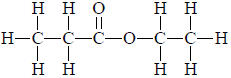
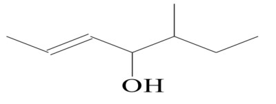
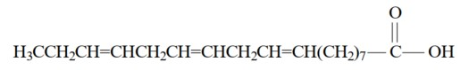
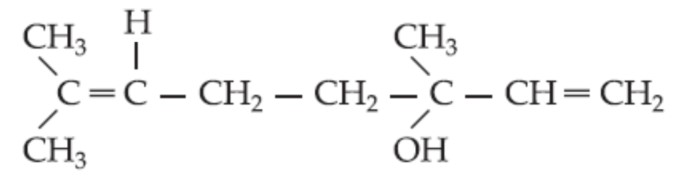

{width="100%"}

| **COMPONENTE CURRICULAR:** Química &nbsp; &nbsp; &nbsp; **DATA**: \_\_\_\_\_\/\_\_\_\_/\_\_\_\_\_\_                                                              
| **TURMA:** 3ª Série Ensino Médio &nbsp; &nbsp; &nbsp; &nbsp; &nbsp; &nbsp; &nbsp; &nbsp; &nbsp; &nbsp; &nbsp; &nbsp;  **PROFESSOR:** Jailson Duarte                                                                                                        
| **ALUNO(A):** \_\_\_\_\_\_\_\_\_\_\_\_\_\_\_\_\_\_\_\_\_\_\_\_\_\_\_\__\_\_\_\_\_\_\_\_\_\_\_\_\_\_\_\_\_\_\_ 
\vspace{-0.5cm}
# \centering Química Orgânica
\vspace{-0.5cm}
**01.** A classificação da cadeia carbônica abaixo é:

{width="20%"}

\vspace{-0.4cm}
a) Aberta, ramificada, heterogênea e saturada;
b) Aberta, normal, homogênea e insaturada;
c) Aberta, normal, heterogênea e saturada;
d) Aberta, ramificada, homogênea e saturada;
e) Aberta, normal, heterogênea e insaturada.

\vspace{-0.5cm}
**02.** A cadeia carbônica abaixo é classificada como:

{width="30%"}

\vspace{-0.4cm}
a) Aberta, ramificada, insaturada, heterogênea
b) Alicíclica, ramificada, insaturada, heterogênea
c) Acíclica, ramificada, insaturada, homogênea
d) Alifática, linear, saturada, homogênea
e) Aberta, linear, saturada, heterogênea

\vspace{-0.5cm}
**03.** A preocupação com o bem-estar e a saúde é uma das características da sociedade moderna. Um dos recentes lançamentos que evidenciam essa preocupação no setor de alimentos é o leite com ômega-3. Essa substância não é produzida pelo nosso organismo, e estudos revelam que sua ingestão é importante para evitar problemas cardiovasculares. A estrutura química do ômega-3 pode ser
assim representada:

{width="50%"}

Com relação à estrutura química do ômega-3, é correto afirmar que essa substância possui cadeia carbônica

\vspace{-0.4cm}
a) alifática, homogênea, saturada e ramificada.
b) alicíclica, heterogênea, insaturada e ramificada.
c) alifática, homogênea, insaturada e normal.
d) homocíclica, heterogênea, saturada e normal.
e) alicíclica, homogênea, saturada e normal.

**04.** O gás liquefeito de petróleo, GLP, é uma mistura de propano, C3H8, e butano,C4H10.
Logo, esse gás é uma mistura de hidrocarbonetos da classe dos:

a)alcanos. &nbsp;&nbsp; b)alcenos.  c)alcinos &nbsp;&nbsp; d)cicloalcanos. &nbsp;&nbsp; e)cicloalcenos.

**05.** Considere as afirmações seguintes sobre hidrocarbonetos.

I. Hidrocarbonetos são compostos orgânicos constituídos somente de carbono e hidrogênio.

II.São chamados de alcenos somente os hidrocarbonetos insaturados de cadeia linear.

III.Cicloalcanos são hidrocarbonetos alifáticos saturados de fórmula geral $C_nH_{2n}.

IV.São hidrocarbonetos aromáticos: bromobenzeno, p-nitrotolueno e naftaleno.
São corretas as afirmações:

a)I e III, apenas.  b)I, III e IV, apenas.  c)II e III, apenas. d)III e IV, apenas. e)I, II e IV, apenas.

**06.** “Química Orgânica é o ramo da Química que estuda os compostos do carbono”. A maioria dos seus compostos são importantes em nossas vidas, destacando o álcool comum, a gasolina, o ácido acético, as proteínas e as vitaminas.

Assinale a alternativa que mostra a característica correta do átomo de carbono.

\vspace{-0.5cm}
a) Forma ligação tripla, e nesta situação o carbono é do tipo sp3.
b) O carbono é tetravalente somente nos hidrocarbonetos.
c) Apresenta capacidade de formar cadeias longas, variadas e estáveis.
d) Liga-se a várias classes de elementos químicos, com exceção da classe dos calcogênios.

**07.** Uma cadeia carbônica alifática, homogênea, saturada, apresenta um átomo de carbono
secundário, dois átomos de carbono quaternário e um átomo de carbono terciário. Esta cadeia apresenta:

a)7 átomos de C.  &nbsp;&nbsp; b) 8 átomos de C.  &nbsp;&nbsp; c) 9 átomos de C.

d)10 átomos de C.  &nbsp;&nbsp; e) 11 átomos de C.

**08.** Componente do óleo da flor de laranjeira, o linalol, tem cadeia carbônica:

{width="30%"}

\vspace{-0.5cm}
a) cíclica, homogênea e saturada.
b) aberta, insaturada e heterogênea.
c) cíclica, insaturada e aromática.
d) aberta, ramificada e insaturada.
e) cíclica, heterogênea e saturada.

**09.**O ácido acetil salicílico de fórmula:

{width="30%"}

\vspace{-0.5cm}
a) acíclica, heterogênea, saturada, ramificada
b) mista, heterogênea, insaturada, aromática
c) mista, homogênea, saturada, alicíclica
d) aberta, heterogênea, saturada, aromática
e) mista, homogênea, insaturada, aromática