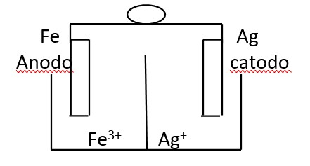

{width="100%"}

| **COMPONENTE CURRICULAR:** Química &nbsp; &nbsp; &nbsp; **DATA**: \_\_\_\_\_\/\_\_\_\_/\_\_\_\_\_\_                                                              
| **TURMA:** 3ª ANO &nbsp; &nbsp; &nbsp; &nbsp; &nbsp; &nbsp; &nbsp; &nbsp; &nbsp; &nbsp; &nbsp; &nbsp;  **PROFESSOR:** Jailson Duarte                                                                                                        
| **ALUNO(A):** \_\_\_\_\_\_\_\_\_\_\_\_\_\_\_\_\_\_\_\_\_\_\_\_\_\_\_\__\_\_\_\_\_\_\_\_\_\_\_\_\_\_\_\_\_\_\_

# \centering Eletroquímica

**01.** 1- Encontre o Nox de todos os elementos abaixo:

a)\ch{H2SO3}   &nbsp; &nbsp; b) \ch{ ClO4-}  &nbsp; &nbsp;  c) \ch{MgCO3}  &nbsp; &nbsp;  d) \ch{PO43-}  &nbsp; &nbsp; e) \ch{K2Cr2O7}

**02.** Apresente uma definição para os seguintes termos:

a) Pilha 
b) Eletrólise 
c) Oxidação 
d) Redução 
e) Agente oxidante
f) Agente redutor 

**03.** Analise a seguinte pilha, representada pelo seguinte esquema:

{width="40%"}
Agora responda:

a) Que eletrodo representa o pólo positivo?

b) E o polo negativo?

c) Escreva as semi-reações de redução e de oxidação e a equação global dessa pilha. 

d) Em qual sentido ocorre o fluxo de elétrons?

e) Qual o eletrodo que sofre corrosão?

f) E qual a solução que vai diminuindo a concentração?

**04.** Quando um elemento sofre oxidação ele: 

a)ganha elétrons              b) perde elétrons
c)ganha prótons               d) perde prótons

**06.** Quando colocamos uma bateria de celular para recarregar, observamos o seguinte fenômeno:

a) uma reação de oxi-redução não espontânea, denominada pilha eletroquímica.
b) uma reação de oxi-redução espontânea, denominada eletrólise.
c) uma reação espontânea que gera corrente elétrica.
d) uma reação de oxi-redução não espontânea provocada pela corrente elétrica e denominada eletrólise.

**07.** Nas pilhas eletroquímicas obtém-se corrente elétrica devido à reação de oxidorredução. Podemos afirmar que:

a) no cátodo, ocorre sempre a semirreação de oxidação.
b) no cátodo, ocorre sempre a semirreação de redução.
c) no ânodo, ocorre sempre a semirreação de redução.
d) no ânodo, ocorre sempre a oxidação e a redução simultaneamente.
e) no cátodo, ocorre sempre a oxidação e a redução simultaneamente.

**08.**  Indique o ânodo e o cátodo das pilhas construídas com os seguintes pares de metais:

a) Zn e Mg    &nbsp; &nbsp; b) Zn e Ni      &nbsp; &nbsp;c) Pb e Ag    &nbsp; &nbsp; d) Mg e Pb    &nbsp; &nbsp; e) Pb e Ni

**09.** Eu também podia decompor a água, se fosse salgada ou acidulada, usando a pilha de Daniell como fonte de força. Lembro o prazer extraordinário que sentia ao decompor um pouco de água em uma taça para ovos quentes, vendo-a separar-se em seus elementos, o oxigênio em um eletrodo, o hidrogênio no outro. A eletricidade de uma pilha de 1 volt parecia tão fraca, e no entanto podia ser suficiente para desfazer um composto químico, a água...

SACKS, O. Tio Tungstênio: memórias de uma infância química. São Paulo: Cia. das Letras, 2002.

O fragmento do romance de Oliver Sacks relata a separação dos elementos que compõem a água. O princípio do método apresentado é utilizado industrialmente na

a) Obtenção de ouro a partir de pepitas.
b) Obtenção de calcário a partir de rochas.
c) Obtenção de alumínio a partir da bauxita.
d) Obtenção de ferro a partir de seus óxidos.
e) Obtenção de amônia a partir de hidrogênio e nitrogênio.
