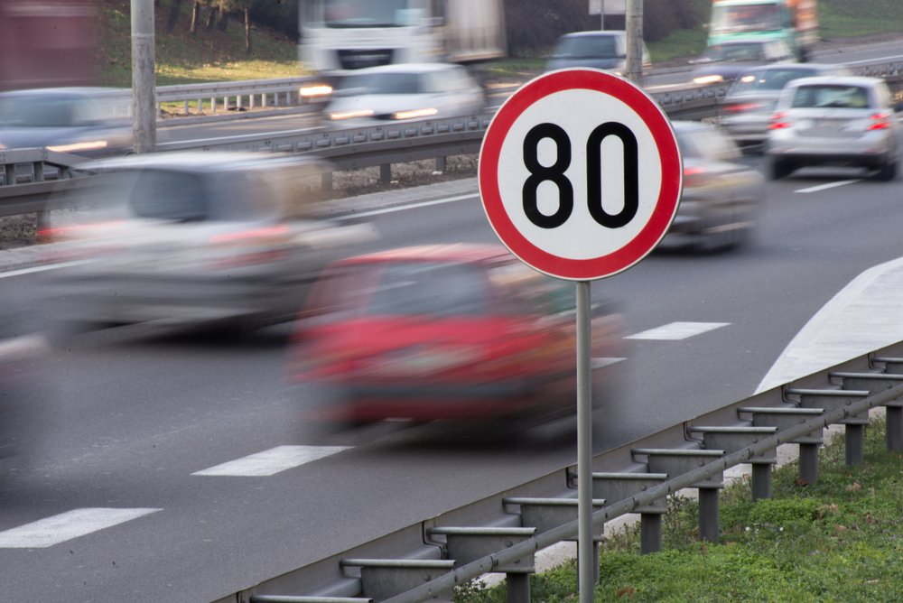
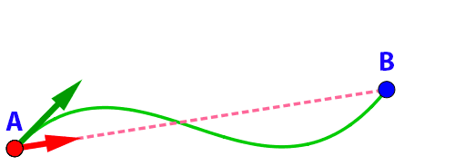

## Importante {.texto .posicao}

O conteúdo desta Aula foi elaborado com base no Livro:

{width="40%"}

## Descrição dos movimentos {.texto .posicao}

- Uma das ações mais comuns realizadas pelos seres humanos é a prática esportiva,
e relacionada a ela está o movimento;

- A descrição detalhada de como ocorrem os movimentos pode ser de grande valia, ajudando na prevenção de acidentes e contusões e na melhora da performance;

- Neste Tema vamos estudar como o movimento ocorre, mas sem nos preocuparmos com suas causas, que é campo de estudo da Cinemática.

## Referencial e movimento relativo {.texto}

{width="70%"}

## Referencial e movimento relativo {.texto}

- O Carro está em movimento em relação à placa. Por que?

- A distância em relação a ela muda com o passar do tempo, ou seja, o carro tem sua posição variando ao longo do tempo.

- A placa é o nosso **Referencial**: o corpo em relação ao qual observamos se
há movimento ou não.

## Corpo extenso e ponto material {.texto}

{width="50%"}

- As dimensões da bicicleta devem ser levadas em conta; ela é, então, um corpo extenso, ou seja, suas dimensões não são desprezíveis nessa situação. Quando as distâncias percorridas pela bicicleta são muito grandes, ela é um **ponto material**.

## Trajetória {.texto}

{width="50%"}

- Ao representarmos geometricamente o percurso ou o caminho de um corpo em movimento estamos representando a trajetória, que pode ser definida como uma linha que conecta os pontos que o corpo percorreu em relação a um referencial.

## Deslocamento {.texto}

{width="60%"}

Podemos definir deslocamento escalar como a variação na posição de um corpo considerando a posição inicial e a posição final.

$$\Delta S = S - S_0$$

## Velocidade {.texto}

{width="60%"}

## Velocidade {.texto}

$$v_m= \frac{\Delta S}{\Delta t} = \frac{S - S_0}{t-t_0}$$

## {width="30%"}

01. Um carro percorreu 200 km em 4 horas. Qual foi a sua velocidade média?

02. Uma bicicleta percorreu 30 km em 2 horas. Qual foi a sua velocidade média?

03. Um carro percorreu 100 km em 2 horas e 30 minutos. Qual foi a sua velocidade média?

04. Um corredor completou uma maratona de 42 km em 3 horas e 30 minutos. Qual foi a sua velocidade média?

