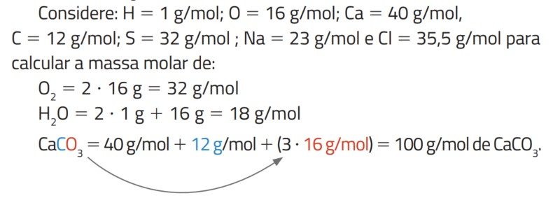
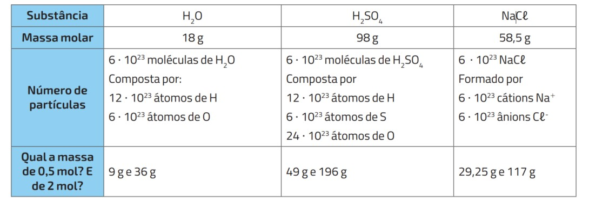
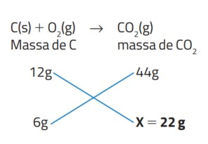
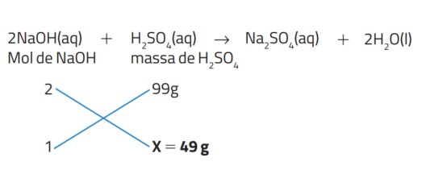
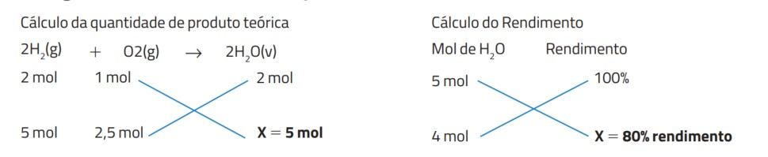

## Importante {.texto .posicao}

O conteúdo desta Aula foi elaborado com base no Livro:

{width="40%"}

## Mol – Quantidade de matéria {.texto .posicao}

-   **Mol**:unidade de medida para a quantidade de matéria, ou seja, átomos, moléculas, elétrons etc. É 

- O físico italiano Lorenzo Romano Amedeo Carlo Avogadro (1776-1856) propôs que, sob mesma temperatura e pressão, volumes iguais de gases diferentes possuem a mesma quantidade de moléculas. 

- Estipulou-se a **constante de Avogadro ($N_A$)**, que representa a quantidade de matéria presente em 1 mol e tem valor numérico igual a:  $1 mol = 6,02214076 \cdot 10^{23}$

## Mol e suas relações {.texto}

-   A **massa molar** (M) é a massa de 1 mol de partículas, sejam elas átomos, moléculas, elétrons etc., e é expressa em **g/mol**. É calculada a partir da massa molar de seus constituintes:

- Exemplo: O carbonato de cálcio $(C_aCO_3)$ tem a seguinte massa molar:   
{width="60%"}

## Mol e suas relações {.texto}

Calcule:

a) a massa de 0,25 mol de $H_2O$.

b) a quantidade de matéria (mol) em 980g de Ácido sulfúrico ($H_2SO_4$)

## Exemplos de massa molar e número de partículas para diferentes substâncias {.texto}

{width="80%"}

## Interpretação de equação química a partir do conceito de mol {.texto}

- As equações químicas representam os processos de transformações de reagentes em produtos e sempre devem ser balanceadas obedecendo as leis de Lavoisier e Proust.

- Por meio de um experimento feito em sistema fechado Lavoisier (1743-1794) percebeu que a massa dos reagentes e dos produtos se conservava. Na mesma época, o químico francês Joseph Louis Proust (1754-1826) enunciou que as reações químicas acontecem em proporções definidas.

## Interpretação de equação química a partir do conceito de mol {.texto}

- A equação química de síntese de água a partir de gás oxigênio e gás hidrogênio, por exemplo, pode ser expressa da seguinte forma: 2 mol de moléculas de gás hidrogênio reagem com 1 mol de moléculas de gás oxigênio formando 2 mol de moléculas de água.

- **Equação**: $$2H_2 + 1O_2 \to 2H_2O$$

- **Massa**: $$2 \cdot 2g + 1 \cdot 32g \to 2 \cdot 18g$$

## Cálculo Estequiométrico. {.texto}

- Os valores na frente das substâncias são chamados de coeficientes estequiométricos da equação;

- Para estabelecer uma relação entre as quantias de reagentes e produtos de uma reação química alguns passos são essenciais;

## Cálculo Estequiométrico. {.texto}

- **Passo 1**: Escreva a equação química;

- **Passo 2**: Faça o balanceamento da equação ajustando os coeficientes para que reagentes e produtos tenham a mesma quantidade de átomos (Lei de Proust e Lei de Lavoisier);

- **Passo 3**: Identifique o que se pede no problema e escreva os valores das substâncias, seguindo os dados do problema.

- **Passo 4**: Estabeleça a relação existente entre os números de mol, massa, no de partículas ou volume para substâncias gasosas.

## Relações estequiométricas entre os participantes da reação {.texto}

-   **Relação de massa com massa:** Equacione a reação de combustão do carbono e determine a massa de gás carbônico formada quando utilizamos 6 g de carbono e quantidade de oxigênio suficiente. Dados: C = 12 g/mol; O = 16 g/mol

- {width="30%"}

## Relações estequiométricas entre os participantes da reação {.texto}

-   **Relação de massa com mol:** Para reagir com 1 mol de hidróxido de sódio $(NaOH)$, qual a massa de ácido sulfúrico $(H_2SO_4)$ necessária para que a neutralização seja total? Dados: C = 12 g/mol; O = 16 g/mol

- {width="50%"}

## Relações estequiométricas entre os participantes da reação {.texto}

-   **Rendimento:** Um laboratorista minucioso usou 5 mol de gás hidrogênio e 2,5 mol de gás oxigênio para sintetizar água, obtendo, ao final do experimento, 4 mol de vapor-d'água. Calcule a quantidade de água que teoricamente deveria ser formada a partir das quantidades de reagentes utilizadas e, em seguida, o rendimento da reação.

- {width="70%"}

## {width="20%"}

01. Daniel, tem uma rotina nutricional equilibrada, e toda manhã consome cereais com leite, sempre colocando exatamente 400 mL de leite. Em um certo dia, resolveu ler o rótulo da caixa de leite para saber a quantidade de cálcio que consumiria ao ingerir os 400 mL do leite escolhido. Vendo que a cada 200g de leite consumia 0,380g de cálcio e sabendo-se que 1 mL de leite = 1 grama de leite, qual o número de átomos de cálcio, consumidas por Daniel nos 400 mL de leite? 

* Dados: $40g \cdot mol^{-1}$ de cálcio; Constante de Avogadro = $6 \cdot 10^{23}$.

## {width="20%"}

02. A amônia (NH3) é um composto químico que pode ser produzido pela reação entre os gases nitrogênio (N2) e hidrogênio (H2), conforme a reação não balanceada a seguir: $X N_{2(g)} + Y H_{2(g)} \to Z NH_{3(g)}$. Quais são os coeficientes estequiométricos X, Y, Z dos compostos apresentados na equação química? Lembre-se: Para a equação estar correta deve-se ter o mesmo número de átomos nos reagentes e nos produtos.

03. Para a reação de síntese da amônia (NH3) ao utilizar 10 g de nitrogênio (N2) reagindo com hidrogênio (H2), qual massa, em gramas, do composto é produzida? Dados: N: 14 g/mol e H: 1 g/mol.

## {width="20%"}

04. A combustão completa é um tipo de reação química que tem como produtos gás carbônico e água. Reagindo álcool etílico (C2H6O) e oxigênio (O2) na proporção em mols de 1:3, quantos mols de CO2 é produzido? Dados: $1 C_2H_6C + 3O_2 \to CO_2 + H_2O$