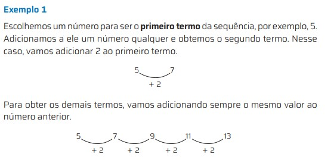
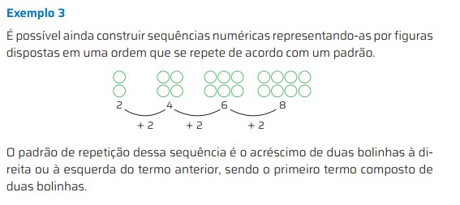
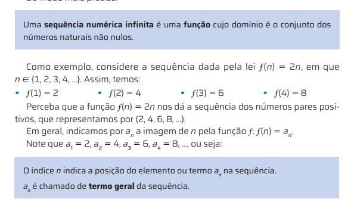

## Importante {.texto .posicao}

O conteúdo desta Aula foi elaborado com base no Livro:

{width="40%"}

## Sequências Numéricas {.texto .posicao}

-  Uma sequência numérica é uma lista de números. Ela pode ser finita ou infinita e pode ter ou não uma lei de formação.

- (5, 5, 4, 8, 6, 9, 1, 2) é uma sequência finita formada pelos algarismos que 
compõem o número de um telefone e não há nenhum padrão aparente 
que permita dizer qual é o próximo termo conhecendo os anteriores;

## Sequências Numéricas {.texto .posicao}

- (4, 16, 64, 256, ...) é uma sequência infinita formada pelos número naturais não nulos que são potências de 4. Essa sequência tem uma  lei de formação: o primeiro termo é 4 e cada termo, a partir do segundo, é igual ao anterior multiplicado por 4.

## Sequências Numéricas {.texto .posicao}

Vamos nos concentrar em estudar sequências nas quais cada número sucede o anterior de acordo com determinada regra, de tal modo que é sempre possível saber se um número pertence ou não à sequência.

- Existem muitas maneiras de construir sequências desse tipo. Acompanhe três 
exemplos a seguir.

## Sequências Numéricas {.texto .posicao}

{width="100%"} 

## Sequências Numéricas {.texto .posicao}

{width="100%"} 

## Sequências Numéricas {.texto .posicao}

{width="100%"} 

## Sequências Numéricas {.texto .posicao}

{width="100%"} 

## Sequências Numéricas {.texto .posicao}

Assim:

$a_1$  é o primeiro termo da sequência;

$a_2$ é o segundo termo da sequência;

$a_n$ é o n-ésimo termo, ou termo geral, da sequência;

$a_{n-1}$ é o termo antecessor de $a_n$;

$a_{n+1}$ é o termo sucessor de a $a_n$;

## Lei de Formação de Uma Sequência {.texto .posicao}
- Considere a sequência (0, 3, 6, 9, 12, 15, 18, 21, ...). Essa sequência é formada pelos múltiplos de 3 no conjunto dos naturais.

- Se chamarmos de n a posição de um termo da sequência, o n-ésimo termo dessa sequência pode ser representado por $3(n -1)$ ou $3n - 3$  e permite determinar qualquer termo da sequência dos múltiplos de 3.

## Lei de Formação de Uma Sequência {.texto .posicao}

- Dizemos que a expressão $3(n -1)$ é a **lei de formação** (também chamada de 
expressão geral) dessa sequência e que n é a variável dessa lei.

- $a_n=3(n -1)$ é o termo geral dessa sequência

## {width="30%"}

01.Considere a sequência (4, 8, 12, 16, ...).

a)Identifique uma possível regularidade e utilize-a para responder aos itens a seguir.

b)Qual é o sexto termo dessa sequência?

c)Qual é o termo geral dessa sequência?

d)Obtenha o 30º termo dessa sequência.

## {width="30%"}

02.Determine os quatro primeiros termos de cada sequência.

a)$a_n=n^3$, com $n \in \mathbb{N}$

b)$a_1=0$, $a_n=2 a_{n-1} + 3$, com $n \in \mathbb{N}$ e $n \ge2$

