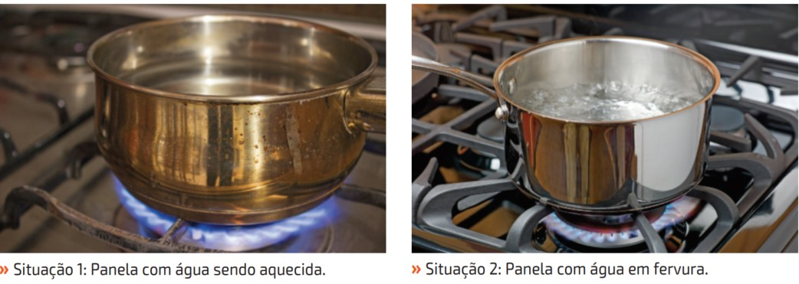
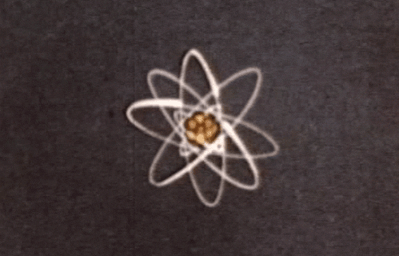
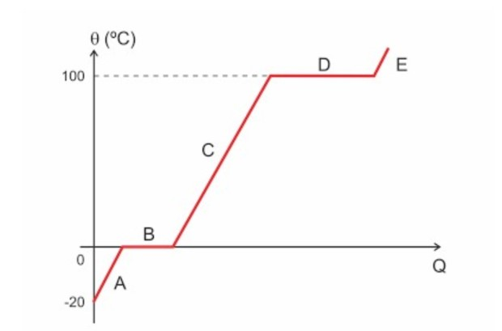

## Importante {.texto .posicao}

O conteúdo desta Aula foi elaborado com base no Livro:

{width="40%"}

## Estados Físicos da Matéria {.texto .posicao}

-   A matéria, suas propriedades e transformações, é um dos objetos de
    estudo das Ciências da Natureza;

-   Essa área é formada por vários campos do conhecimento (Química,
    Física e Biologia) e tem como objetivo investigar fenômenos e
    processos naturais para entender e atuar no mundo que nos cerca;

-   A partir da interpretação desses fenômenos é possível fazer
    previsões sobre eles, avaliar riscos e benefícios e desenvolver tecnologias para o bem-estar da sociedade de maneira sustentável;

## Exemplo do Cotidiano {.texto}

{width="80%"}

-   Sabendo que a temperatura é relevante no cozimento de alimentos,
    qual das situa ções retratadas nas imagens apresenta condições mais
    propícias para o cozimento de macarrão? Por quê?

## A constituição da matéria {.texto}

1.  O que é Matéria?

-   Tudo que possui massa e ocupa lugar no espaço.

-   Há mais de dois mil anos já afirmavam que a matéria era composta por
    **átomos**;

-   {width="40%"}

## Estados físicos da matéria {.texto}

2.  Qual a diferença entre a água que bebemos, o gelo e o vapor-d'água?

-   A matéria sofre transformações que podem ser classificadas em
    transformações físicas e transformações químicas. As transformações
    químicas são caracterizadas pelo surgimento de uma nova substância.
    Já nas transformações físicas não ocorre a formação de novos
    produtos.
-   Na Terra, a matéria se apresenta comumente em três estados físicos:
    sólido, líquido e gasoso. Esses estados se caracterizam de acordo
    com os arranjos estruturais, resultantes das forças de coesão
    existentes entre os átomos ou moléculas.

## Estados físicos da matéria {.texto}

{width="60%"}

## Mudança de Estados Físicos {.texto}

-   **Fusão:** passagem do estado sólido para o líquido;

-   **Vaporização:** passagem do estado líquido para o gasoso. Pode
    ocorrer de duas maneiras: por evaporação ou por ebulição. A
    evaporação ocorre de maneira lenta e gradativa, como uma roupa
    secando no varal a qualquer temperatura. Já a ebulição ocorre de
    maneira mais rápida, por exemplo, o que acontece com a água, ao ser
    fervida;

-   **Solidificação**: passagem do estado líquido para o sólid;

## Mudança de Estados Físicos {.texto}

-   **Condensação:** (ou liquefação) é a passagem do estado gasoso para
    o líquido.

-   **Sublimação:** algumas substâncias como a naftalina e o gelo-seco,
    nas condições ambientes, passam diretamente do estado sólido para o
    gasoso, sem passar pelo estado líquido.

## Mudança de Estados Físicos {.texto}

{width="80%"}

## {width="30%"}

01. Quais são os três estados físicos básicos da matéria?

02. O que é fusão?  E solidificação? 

03. A passagem do estado líquido para o estado gasoso pode ocorrer por três processos diferentes: evaporação, ebulição ou calefação. O que os diferencia?

04. Qual a diferença entre liquefação e condensação?

05. Como se chama a mudança entre os estados sólidos e gasosos?

## {width="30%"}

06. Um estudante fez a seguinte afirmação: “ Enquanto o gelo derretia, sua temperatura subiu de 0oC à 5 oC”. Você acha que a afirmação do estudante está correta? Justifique.

07. Ao cozinhar alimentos, como carne ou legumes, as pessoas costumam diminuir a
intensidade da chama do fogo assim que a água começa a ferver. Será que desse
modo a comida demora mais para ficar pronta? Qual a vantagem deste procedimento?

## {width="20%"}

08. O gráfico abaixo mostra a mudança de estado de uma massa de água em função
da quantidade de calor (Q):
{width="20%"}

8a) Qual é o estado físico da água nos trechos A, C e E do gráfico?

8b) Que mudança de estado está ocorrendo no trecho B? E no trecho D?

## {width="20%"}

08. O gráfico abaixo mostra a mudança de estado de uma massa de água em função
da quantidade de calor (Q):
{width="20%"}

8c) No trecho B e no trecho D a temperatura está variando?

8d) O que os números 0 e 100 no gráfico indicam?

## {width="20%"}

09. O café solúvel é obtido a partir do café comum dissolvido em água. A solução é congelada e, a seguir, diminui-se bruscamente a pressão. Com isso, a água passa direta e rapidamente para o estado gasoso, sendo eliminada do sistema por sucção. Com a remoção da água do sistema, por esse meio, resta o café em pó e seco. Identifique as mudanças de estado físico ocorridas neste processo:

(a)solidificação e fusão.

(b)vaporização e liquefação

(c)fusão e ebulição.

(d)solidificação e sublimação.

(e)fusão e liquefação