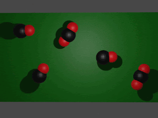
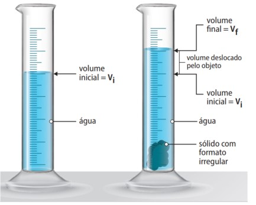
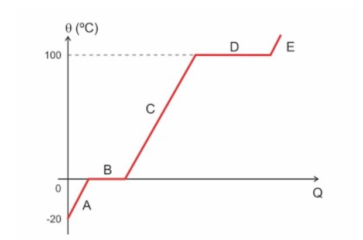

## Importante {.texto .posicao}

O conteúdo desta Aula foi elaborado com base no Livro:

{width="40%"}

## Substâncias e Misturas {.texto .posicao}

-   Substâncias são formadas por agrupamentos de átomos ou moléculas que podem ser iguais ou diferentes. Moléculas podem ser formadas  pela ligação entre dois ou mais átomos.

-   Substâncias formadas por um único elemento químico são denominadas **substâncias simples**;

- Substâncias formadas por formadas por dois ou mais elementos são denominadas **substâncias compostas**.

## Exemplo Substância Simples. {.texto}

{width="50%"}

**Fonte**: http://gtpinto.blogspot.com

## Exemplo Substância Composta {.texto}

{width="50%"}

**Fonte**: http://gtpinto.blogspot.com

## Mistura Homogênea e Mistura Heterogênea  {.texto}

- Quando diferentes substâncias se misturam, elas podem ser miscíveis ou não. Caso sejam miscíveis, a mistura formada por elas é classificada como **mistura homogênea**; caso contrário, é classificada como **mistura heterogênea**;

-  Como é possível identificar uma mistura homogênea ou heterogênea sem saber se as substâncias que a compõem são miscíveis?

## Mistura Homogênea e Mistura Heterogênea  {.texto}

- Se for possível enxergar as substâncias em separado (chamada de fase visual), essa mistura é heterogênea. Se não for possível enxergar as substâncias de modo separado, essa mistura pode ser homogênea.

## Mistura Homogênea e Mistura Heterogênea  {.texto}

{width="50%"}

**Fonte**: https://vaiquimica.com.br/

## Separação de misturas  {.texto}

As misturas podem ser separadas por meio de diferentes processos, que dependem das características dos materiais misturados. Alguns fatores físicos e químicos
são determinantes para as separações, como tamanho das partículas, temperaturas
de ebulição e fusão, e principalmente a densidade.

## Densidade  {.texto}

* **Densidade** é uma propriedade da matéria que relaciona a massa (m) e o volume (V) através da razão $d=\frac{m}{v}$. No Sistema Internacional de Unidades (SI), a unidade de medida da densidade é $kg/m^3$, na qual a massa é expressa em quilograma (kg) e o volume em metros cúbicos (m3). 

* Podemos utilizar como unidade de medida de volume o mililitro (mL), que é a capacidade
equivalente a 1 centímetro cúbico ($cm^3$), e o grama como unidade de massa, de
modo que a unidade de medida da densidade seja $g/mL$, que é equivalente a $g/cm^3$.

## Como podemos obter o volume de pequenos sólidos? {.texto}

* O volume de um pequeno sólido irregular pode ser determinado ao inseri-lo em uma proveta com volume inicialmente conhecido de água. A quantidade de água deslocada, depois da imersão do sólido, representa o volume desse objeto.

## Como podemos obter o volume de pequenos sólidos? {.texto}

{width="50%"}

## Métodos de separação de misturas {.texto}

: método que utiliza as mãos ou um artefato para separar componentes de diferentes tamanhos de uma mistura heterogênea formada por sólidos ou sólido e líquido.

Peneiração: método em que uma mistura heterogênea formada por sólidos ou por um sólido e um líquido atravessa uma peneira.

Ventilação: método que utiliza a força do vento para separar o componente de maior densidade de uma mistura heterogênea formada por sólidos.

Levigação: método que utiliza a força de um líquido para separar o componente de maior densidade de uma mistura heterogênea formada por sólidos.

Flotação: método em que um gás é adicionado a uma mistura formada por um sólido e um líquido para haver interação entre um deles e as bolhas e, posteriormente, a separação.

Separação magnética: método que utiliza um ímã para atrair o componente metálico de uma mistura.

Decantação: método que utiliza a diferença de densidade e ausência de solubilidade para separar os componentes de uma mistura heterogênea formada por líquidos ou sólido e líquido.

Centrifugação: é o método que utiliza uma centrífuga para acelerar a decantação;

Dissolução fracionada: método em que um líquido é adicionado a uma mistura heterogênea de sólidos com o objetivo de dissolver um deles.

Filtração simples: método em que uma mistura heterogênea formada por um sólido e um líquido atravessa um filtro para que haja a separação dos componentes.

Filtração a vácuo: método em que uma mistura heterogênea formada por um sólido e um líquido atravessa um filtro, caindo em um recipiente com vácuo.

Cristalização fracionada: método em que os diferentes solutos dissolvidos em um solvente são separados à medida que o solvente sofre evaporação. Esse método baseia-se na diferença de solubilidade.

Fusão fracionada: método em que aquecemos uma mistura homogênea formada por sólidos para separar os componentes em razão dos diferentes pontos de fusão;

Sublimação fracionada: método em que aquecemos uma mistura homogênea formada por sólidos, sendo um deles sublimável.

Destilação simples: método em que aquecemos uma mistura homogênea formada por sólido e líquido, sendo o líquido separado do sólido por vaporização seguida de condensação.

Destilação fracionada: método em que aquecemos uma mistura homogênea formada por líquidos para separá-los em razão dos diferentes pontos de ebulição.

## {width="30%"}

01. Um objeto de metal, de massa 14,5 g, é colocado em uma proveta contendo 50 mL de
água. Após a imersão desse objeto, o volume medido na proveta é de 52 mL. Determine a
densidade, em g/mL, do objeto de metal.

02. O que é fusão?  E solidificação? 

03. A passagem do estado líquido para o estado gasoso pode ocorrer por três processos diferentes: evaporação, ebulição ou calefação. O que os diferencia?

04. Qual a diferença entre liquefação e condensação?

05. Como se chama a mudança entre os estados sólidos e gasosos?

## {width="30%"}

06. Um estudante fez a seguinte afirmação: “ Enquanto o gelo derretia, sua temperatura subiu de 0ºC à 5ºC”. Você acha que a afirmação do estudante está correta? Justifique.

07. Ao cozinhar alimentos, como carne ou legumes, as pessoas costumam diminuir a
intensidade da chama do fogo assim que a água começa a ferver. Será que desse
modo a comida demora mais para ficar pronta? Qual a vantagem deste procedimento?

## {width="20%"}

08. O gráfico abaixo mostra a mudança de estado de uma massa de água em função
da quantidade de calor (Q):
{width="20%"}

8a) Qual é o estado físico da água nos trechos A, C e E do gráfico?

8b) Que mudança de estado está ocorrendo no trecho B? E no trecho D?

## {width="20%"}

08. O gráfico abaixo mostra a mudança de estado de uma massa de água em função
da quantidade de calor (Q):
{width="20%"}

8c) No trecho B e no trecho D a temperatura está variando?

8d) O que os números 0 e 100 no gráfico indicam?

## {width="20%"}

09. O café solúvel é obtido a partir do café comum dissolvido em água. A solução é congelada e, a seguir, diminui-se bruscamente a pressão. Com isso, a água passa direta e rapidamente para o estado gasoso, sendo eliminada do sistema por sucção. Com a remoção da água do sistema, por esse meio, resta o café em pó e seco. Identifique as mudanças de estado físico ocorridas neste processo:

(a)solidificação e fusão.

(b)vaporização e liquefação

(c)fusão e ebulição.

(d)solidificação e sublimação.

(e)fusão e liquefação