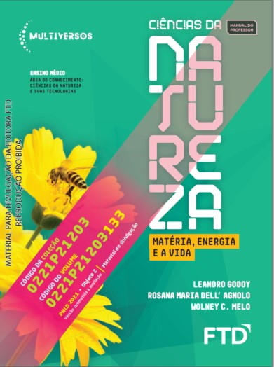

## Importante {.texto .posicao}

O conteúdo desta Aula foi elaborado com base no Livro:

{width="40%"}

## Substâncias e Misturas {.texto .posicao}

-   Substâncias são formadas por agrupamentos de átomos ou moléculas que podem ser iguais ou diferentes. Moléculas podem ser formadas  pela ligação entre dois ou mais átomos.

-   Substâncias formadas por um único elemento químico são denominadas **substâncias simples**;

- Substâncias formadas por formadas por dois ou mais elementos são denominadas **substâncias compostas**.

## Exemplo Substância Simples. {.texto}

{width="50%"}

**Fonte**: http://gtpinto.blogspot.com

## Exemplo Substância Composta {.texto}

{width="50%"}

**Fonte**: http://gtpinto.blogspot.com

## Mistura Homogênea e Mistura Heterogênea  {.texto}

- Quando diferentes substâncias se misturam, elas podem ser miscíveis ou não. Caso sejam miscíveis, a mistura formada por elas é classificada como **mistura homogênea**; caso contrário, é classificada como **mistura heterogênea**;

-  Como é possível identificar uma mistura homogênea ou heterogênea sem saber se as substâncias que a compõem são miscíveis?

## Mistura Homogênea e Mistura Heterogênea  {.texto}

- Se for possível enxergar as substâncias em separado (chamada de fase visual), essa mistura é heterogênea. Se não for possível enxergar as substâncias de modo separado, essa mistura pode ser homogênea.

## Mistura Homogênea e Mistura Heterogênea  {.texto}

{width="50%"}

**Fonte**: https://vaiquimica.com.br/

## Separação de misturas  {.texto}

As misturas podem ser separadas por meio de diferentes processos, que dependem das características dos materiais misturados. Alguns fatores físicos e químicos
são determinantes para as separações, como tamanho das partículas, temperaturas
de ebulição e fusão, e principalmente a densidade.

## Densidade  {.texto}

* **Densidade** é uma propriedade da matéria que relaciona a massa (m) e o volume (V) através da razão $d=\frac{m}{v}$. No Sistema Internacional de Unidades (SI), a unidade de medida da densidade é $kg/m^3$, na qual a massa é expressa em quilograma (kg) e o volume em metros cúbicos (m3). 

* Podemos utilizar como unidade de medida de volume o mililitro (mL), que é a capacidade
equivalente a 1 centímetro cúbico ($cm^3$), e o grama como unidade de massa, de
modo que a unidade de medida da densidade seja $g/mL$, que é equivalente a $g/cm^3$.

## Como podemos obter o volume de pequenos sólidos? {.texto}

* O volume de um pequeno sólido irregular pode ser determinado ao inseri-lo em uma proveta com volume inicialmente conhecido de água. A quantidade de água deslocada, depois da imersão do sólido, representa o volume desse objeto.

## Como podemos obter o volume de pequenos sólidos? {.texto}

{width="50%"}

## Métodos de separação de misturas {.texto}

**Catação**: método que utiliza as mãos ou um artefato para separar componentes de diferentes tamanhos de uma mistura heterogênea formada por sólidos ou sólido e líquido.

**Peneiração**: método em que uma mistura heterogênea formada por sólidos ou por um sólido e um líquido atravessa uma peneira.

**Ventilação**: método que utiliza a força do vento para separar o componente de maior densidade de uma mistura heterogênea formada por sólidos.

## Métodos de separação de misturas {.texto}

**Levigação**: método que utiliza a força de um líquido para separar o componente de maior densidade de uma mistura heterogênea formada por sólidos.

**Flotação**: método em que um gás é adicionado a uma mistura formada por um sólido e um líquido para haver interação entre um deles e as bolhas e, posteriormente, a separação.

**Separação magnética**: método que utiliza um ímã para atrair o componente metálico de uma mistura.

## Métodos de separação de misturas {.texto}

**Decantação**: método que utiliza a diferença de densidade e ausência de solubilidade para separar os componentes de uma mistura heterogênea formada por líquidos ou sólido e líquido.

**Centrifugação**: é o método que utiliza uma centrífuga para acelerar a decantação;

**Dissolução fracionada**: método em que um líquido é adicionado a uma mistura heterogênea de sólidos com o objetivo de dissolver um deles.

## Métodos de separação de misturas {.texto}

**Filtração simples**: método em que uma mistura heterogênea formada por um sólido e um líquido atravessa um filtro para que haja a separação dos componentes.

**Filtração a vácuo**: método em que uma mistura heterogênea formada por um sólido e um líquido atravessa um filtro, caindo em um recipiente com vácuo.

**Cristalização fracionada**: método em que os diferentes solutos dissolvidos em um solvente são separados à medida que o solvente sofre evaporação. Esse método baseia-se na diferença de solubilidade.

## Métodos de separação de misturas {.texto}

**Fusão fracionada**: método em que aquecemos uma mistura homogênea formada por sólidos para separar os componentes em razão dos diferentes pontos de fusão;

**Sublimação fracionada**: método em que aquecemos uma mistura homogênea formada por sólidos, sendo um deles sublimável.

**Destilação simples**: método em que aquecemos uma mistura homogênea formada por sólido e líquido, sendo o líquido separado do sólido por vaporização seguida de condensação.

**Destilação fracionada**: método em que aquecemos uma mistura homogênea formada por líquidos para separá-los em razão dos diferentes pontos de ebulição.

## {width="30%"}

01. Um objeto de metal, de massa 14,5 g, é colocado em uma proveta contendo 50 mL de água. Após a imersão desse objeto, o volume medido na proveta é de 52 mL. Determine a
densidade, em g/mL, do objeto de metal.

## {width="30%"}

Questão 02. Relacione o método de separação de misturas com a propriedade utilizada no processo de separação.

I. Decantação
II. Destilação
III. Extração por solvente

A. Solubilidade

B. Densidade

C. Temperatura de ebulição

## {width="30%"}

Questão 03. Analise as afirmativas a seguir e julgue como verdadeiro (V) ou falso (F).

( ) Na filtração o sólido e o líquido são separados pela diferença do tamanho das partículas.

( ) A centrifugação é um processo de decantação acelerado pela força da gravidade.

( ) A separação na cromatografia é realizada pela interação dos componentes da mistura com a fase móvel e a fase estacionária.

## {width="30%"}
04. (Vunesp) Na preparação do café, a água quente entra em contato com o pó e é separada no coador. As operações envolvidas nessa separação são, respectivamente:

a) destilação e decantação.

b) filtração e destilação.

c) destilação e coação.

d) extração e filtração.

e) extração e decantação.

## {width="30%"}

05. (Unirio) Uma mistura formada por gasolina, água, serragem e sal de cozinha pode ser separada nos seus diversos componentes seguindo-se as seguintes etapas:

a) filtração, decantação e destilação.

b) catação e decantação.

c) sublimação e destilação.

d) prensagem e decantação.

e) destilação e decantação.

## {width="30%"}

06. Cesgranrio) Numa das etapas do tratamento da água que abastece uma cidade, a água é mantida durante um certo tempo em tanques para que os sólidos em suspensão se depositem no fundo. A essa operação denominamos:

a) filtração.

b) sedimentação.

c) sifonação.

d) centrifugação.

e) cristalização.

## {width="30%"}

07. (Unifor) Um sólido A está totalmente dissolvido num líquido B. É possível separar o solvente B da mistura por meio de uma:

a) centrifugação.

b) sifonação.

c) decantação.

d) filtração.

e) destilação.

## {width="20%"}

08. (UnB) Julgue os itens a seguir, marcando C para os corretos e E para os errados.

1)A evaporação permite a separação de dois líquidos bastante voláteis.
2)É possível a separação de um material homogêneo líquido-líquido por destilação fracionada.
3)A separação de componentes do petróleo é feita com base na diferença entre as respectivas temperaturas de ebulição.
4)O princípio da destilação fracionada fundamenta-se na diferença de solubilidade dos sólidos de um material.

## {width="20%"}

08. (UFRGS) Um sistema heterogêneo bifásico é formado por três líquidos diferentes A, B e C. Sabe-se que:

A e B são miscíveis entre si;
C é imiscível com A e com B;
A é mais volátil que B.
Com base nessas informações, os métodos mais adequados para separar os três líquidos são:

a) centrifugação e decantação.
b) decantação e fusão fracionada.
c) filtração e centrifugação.
d) filtração e destilação fracionada.
e) decantação e destilação fracionada.

## {width="20%"}

09. (Cairu) Sobre processos de separação de materiais, indique a alternativa correta.

a) Coar café, um processo de separação de materiais, é um fenômeno físico.
b) Fase de um sistema são os componentes que formam esse sistema.
c) Um dos processos frequentemente usados para separar água do mar do sal é a filtração.
d) Quando as substâncias passam do estado sólido para o líquido, há evidência de que ocorreu reação química.
e) A destilação fracionada é um processo usado frequentemente para se separar dois sólidos.