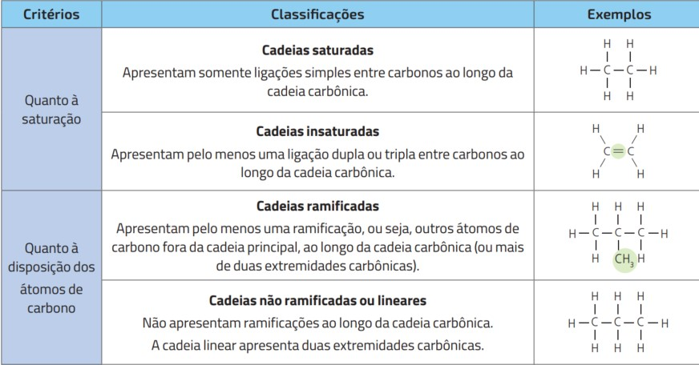
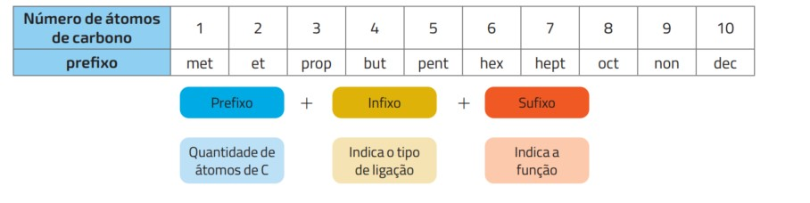
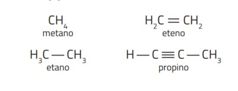

## Importante {.texto .posicao}

O conteúdo desta Aula foi elaborado com base no Livro:

{width="40%"}

## Química Orgânica {.texto}

- O elemento químico carbono ($C_6^{12}$) é encontrado naturalmente no planeta Terra de duas maneiras – na grafita e no diamante. Também é incorporado nos organismos vivos, formando grande número de compostos, entre eles os carboidratos, as proteínas e os lipídios. No processo de fossilização dos seres vivos, o carbono se acumula no petróleo, carvão mineral e gás natural.

- O estudo da grande maioria dos compostos químicos que possuem carbono é realizado pela área
da Química chamada Química Orgânica.

## Principais fontes de compostos orgânicos {.texto}

- Petróleo e gás natural   
{width="90%"}

##  Principais fontes de compostos orgânicos {.texto}

- Há milhões de anos, vegetais e animais mortos foram cobertos por camadas de sedimentos,
conforme passavam parcialmente por decomposição pela ação de bactérias, em baixas concentrações de gás oxigênio. Com o tempo, sob influência das elevadas temperaturas, ocorreram reações químicas que os transformaram em compostos formados somente
por hidrogênio e carbono, chamados de hidrocarbonetos, que podem ser líquidos (petróleo) ou gasosos (gás natural).

##  Principais fontes de compostos orgânicos {.texto}

- O petróleo que é extraído não é utilizado em sua forma bruta. Ele é refinado
por meio da destilação fracionada, que separa suas frações conforme a massa
molar aproximada dos hidrocarbonetos. Nessas frações, são encontradas também
porções de compostos de carbono que contêm outros elementos, como o nitrogênio, o enxofre e o oxigênio.

## Principais fontes de compostos orgânicos {.texto}

- Petróleo e gás natural   
{width="100%"}

## Carvão mineral {.texto}

- O carvão mineral foi formado a partir do soterramento e compactação de vegetais durante
milhões de anos, em ambiente com pouco oxigênio. Conforme a pressão e a temperatura
aumentavam, a celulose $(C_6H_{10}O_5)_n$, principal matéria prima do carvão, se transformava em diferentes compostos, que diferem entre si quanto ao teor de carbono residual: turfa, linhito, hulha e antracito

## Caraterísticas do carbono e das cadeias carbônicas {.texto}

- O carbono pertence ao grupo 14, portanto, é tetravalente, isto é, quatro é o número de
ligações covalentes necessárias para completar oito elétrons na camada de valência, característica que confere ao carbono a capacidade de formar cadeias carbônicas de formas diferentes. Os quatro tipos de ligações que o carbono pode apresentar na formação das cadeias são:

## Caraterísticas do carbono e das cadeias carbônicas {.texto}
 {width="120%"}

## Classifi cação de carbonos em cadeias carbônicas {.texto}

{width="100%"}

A estabilidade na camada de valência é atingida quando os elementos C, H, O, N, P e S realizam os seguintes números de ligações: C = 4 ligações, H = 1 ligação, O = 2 ligações, N = 3 ligações, S = 2 ligações e P = 3 ligações.

## Formas de representação de uma cadeia carbônica. {.texto}

{width="100%"}

## Classificação das cadeias carbônicas {.texto}

{width="100%"}

## Classificação das cadeias carbônicas {.texto}

{width="100%"}

## Classificação das cadeias carbônicas {.texto}

{width="100%"}

## {width="20%"}

01. Dê a fórmula molecular e a classificação das seguintes cadeias carbônicas:

- {width="100%"}

## Funções e nomenclatura dos compostos orgânicos {.texto}

- **Função hidrocarboneto**: É característica de alcanos, que possuem apenas ligações simples na molécula, alcenos, que possuem uma dupla ligação, alcinos, que possuem uma tripla ligação, e alcadienos, que possuem duas duplas ligações.

- Os compostos orgânicos são nomeados seguindo regras. De forma geral, o prefixo indica o
número de carbonos na cadeia principal, o infixo indica o tipo de ligação – simples (an), dupla (en) ou tripla (in) e o sufixo indica a função.

## Nomenclatura dos compostos orgânicos {.texto}

{width="100%"}

## Nomenclatura dos compostos orgânicos {.texto}

Exemplos de hidrocarbonetos, cujo sufixo é **(o)**:

{width="100%"}

## Nomenclatura dos compostos orgânicos {.texto}

1. Metano

{width="100%"}

## Nomenclatura dos compostos orgânicos {.texto}

1. Etano

{width="80%"}

## Nomenclatura dos compostos orgânicos {.texto}

1. Eteno

{width="80%"}

## {width="20%"}

Dê nome à substância: CH2= CH — CH3

## {width="20%"}

A gasolina é obtida a partir do petróleo e, basicamente, pode ser considerada uma mistura de hidrocarbonetos. Três de seus componentes estão representados a seguir:

$$H_3C \;─ \;(CH_2)_5 \;─\; CH_3$$

$$H_3C \;─ \;C(CH_3)_2 \;─ \;CH_2 \;─ \;CH(CH_3)_2$$

$$H_3C \;─ \; (CH_2)_6 \;─ \; CH_3$$

Os nomes desses três compostos, respectivamente, são:

## {width="20%"}

{width="50%"}
